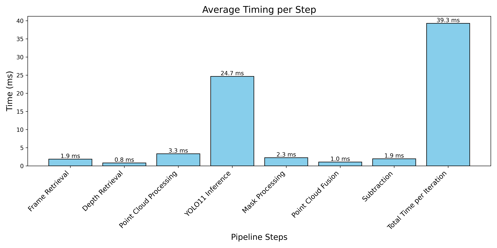
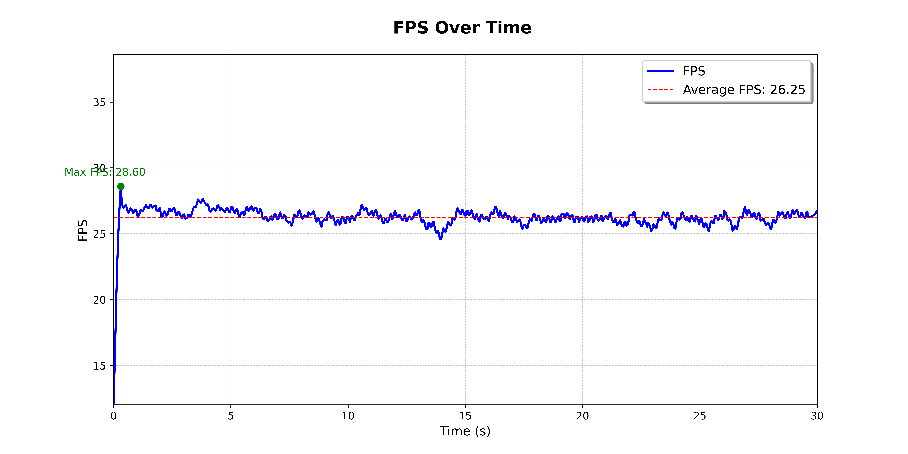

# **Real-Time Vision Pipeline for 3D Object Detection, Segmentation, and Reconstruction**
This repository implements a modular, real-time vision pipeline for object detection, segmentation, and 3D reconstruction using YOLO11 and a set of ZED Stereo Cameras. The project leverages GPU acceleration and advanced computer vision techniques to create a scalable solution for collaborative robotics, including tasks such as manipulation and obstacle avoidance, workspace analysis, and dynamic object tracking.

<p align="center">
  
</p>
<p align="center"><strong>Figure 1: Average Timing Per Step for 1 Object Voxelsize = 5mm</strong></p>

<p align="center">
  
</p>
<p align="center"><strong>Figure 2: FPS Over Time for 1 Object Voxelsize = 5mm</strong></p>


## **Table of Contents**

1. [Features and Functionalities](#1-features-and-functionalities)
   - [Real-Time Object Detection, Segmentation, and Tracking](#real-time-object-detection-segmentation-and-tracking)
   - [3D Reconstruction from Depth Maps](#3d-reconstruction-from-depth-maps)
   - [Advanced Point Cloud Processing](#advanced-point-cloud-processing)
   - [Interactive Visualization](#interactive-visualization)
   - [Modular and Extensible Design](#modular-and-extensible-design)
   - [Performance Monitoring](#performance-monitoring)
2. [Getting Started](#2-getting-started)
   - [Prerequisites](#prerequisites)
   - [Installation](#installation)
3. [Usage](#3-usage)
   - [Available Scripts](#available-scripts)
4. [Performance Benchmarking](#4-performance-benchmarking)
5. [Main Functions](#5-main-functions)
6. [Notes](#6-notes)
7. [Troubleshooting](#7-troubleshooting)
   - [Common Issues and Solutions](#common-issues-and-solutions)

## **1. Features and Functionalities**

### **Real-Time Object Detection, Segmentation, and Tracking:**
- Utilizes **YOLO11** for detecting and segmenting objects of interest (e.g., bottles, cups, laptops) in frames from stereo cameras.
- Tracks objects and their IDs across frames to ensure consistency. The pipeline supports two tracking algorithms:
  - **ByteTrack**: A lightweight, real-time object tracker that employs a simple yet effective online and real-time tracking algorithm.
  - **DeepSORT**: A deep learning-based object tracker that combines appearance features and motion information for robust tracking.

### **3D Reconstruction from Depth Maps:**
- Converts 2D segmentation masks into 3D point clouds using ZED stereo camera depth maps and camera intrinsics.
- Improves accuracy and efficiency through depth-to-3D mapping.

### **Advanced Point Cloud Processing:**
- **Down sampling**: Reduces point cloud density using voxel grid filtering.
- **Outlier Removal**: Removes statistical outliers to enhance point cloud quality.
- **Cropping**: Crops point clouds to specific regions of interest.
- **Transformation**: Transforms point clouds to a common reference frame for fusion.
- **Fusion**: Combines point clouds from multiple cameras based on centroid distances to create a unified 3D representation.
- **Subtraction**: Removes the reconstructed object point cloud from the workspace.

### **Interactive Visualization:**
- Displays annotated video frames with bounding boxes, segmentation masks, and object labels.
- Visualizes 3D point clouds of detected objects and the workspace using Open3D.
- Displays real-time frame rate (FPS) for performance monitoring.

### **Modular and Extensible Design:**
- Organized into reusable components for:
  - Camera management
  - Object detection and segmentation
  - Point cloud generation and fusion
- Easily extendable for future functionalities.

### **Performance Monitoring:**
- Logs real-time FPS and timing metrics for each pipeline stage.
- Enables performance analysis and optimization for specific setups.

## **2. Getting Started**

### **Prerequisites**
1. **Hardware**:
   - NVIDIA RTX 4090 or equivalent GPU.
   - ZED Stereo Cameras.

2. **Software**:
   - Python >= 3.8
   - CUDA-enabled GPU drivers
   - **ZED SDK and Python API**:
     - Install the [ZED SDK](https://www.stereolabs.com/zed-sdk/) and its Python API, which are required for camera access and depth map generation.
     - Detailed installation instructions can be found on the [Stereolabs documentation page](https://www.stereolabs.com/docs/).

### **Installation**
1. Clone the repository:
   ```bash
   git clone https://github.com/janfrischi/RT-3D-Reconstruction.git
   cd your-directory
   ```

2. Install required dependencies from the `requirements.txt` file:
   ```bash
   pip install -r requirements.txt
   ```

3. Download the YOLOv11 model:
   - Ensure the YOLOv11 model `yolo11x-seg.pt` or any other size is stored in the `models/` directory.
   - You can download it from the [Ultralytics repository](https://github.com/ultralytics).
   - Another option is to simply use `model = YOLO("yolo11x-seg.pt").to(device)` in the code to download the model automatically.

4. Connect ZED cameras and set up the environment.
   - Ensure the ZED cameras are connected and recognized by the system. Use USB 3.0 10GB/s ports for optimal performance.
   - Set up the ZED SDK and Python API for camera access.
   - Make sure the camera serial numbers are correctly set in the code.

## **3. Usage**

### **Available Scripts**
This repository provides multiple scripts tailored to specific hardware configurations and use cases:

**`2cams.py`**:
   - Runs the vision pipeline with two ZED cameras.
   - Streamlined version that imports all necessary functions from the vision_pipeline_utils.py file. This script is preconfigured with default parameters, such as voxel_size=0.005, making it ready to use out of the box.

**`2cams_mask_cpu.py`**:
   - Optimized for running the vision pipeline with CPU-based mask processing.
   - Ideal when GPU resources are limited.

**`2cams_mask_gpu.py`**:
   - Optimized for GPU-based mask processing, leveraging CUDA for enhanced performance.
   - Recommended for real-time applications where high-speed processing is required.

**`visualizer_fps.py`**: 
   - Uses the fps_log.csv file to visualize the frame rate over time.

**`visualizer_performance.py`**:
   - Uses the timings.csv file to visualize the performance metrics over time.r3oy

## **4. Performance Benchmarking**

The pipeline tracks the following metrics for each frame:
- **Frame Retrieval Time**: Time taken to retrieve frames from cameras.
- **Depth Retrieval Time**: Time for generating depth maps.
- **YOLO Inference Time**: Time for object detection and segmentation.
- **Point Cloud Processing Time**: Time to process and fuse point clouds.
- **Overall Loop Time**: Total time per frame.

All timings are logged in `timings.csv` and `fps_log.csv` for analysis.

## **5. Main Functions**
- **`convert_mask_to_3d_points()`**: Converts 2D segmentation masks into 3D coordinates using depth maps.
- **`perform_yolo_inference()`**: Performs object detection and segmentation and object tracking using YOLO11.
- **`downsample_point_cloud_gpu()`**: Down samples point clouds using voxel grid filtering on the GPU.
- **`crop_point_cloud_gpu()`**: Crops the transformed point cloud to a specific region of interest.
- **`fuse_point_clouds_centroid()`**: Fuses point clouds from two cameras based on centroid distance.
- **`process_point_clouds()`**: Processes point clouds by down sampling, cropping, and transforming them.
- **`subtract_point_clouds_gpu()`**: Subtracts object point clouds from the workspace.


## **6. Notes**
- The vision pipeline is optimized for real-time performance, leveraging CUDA acceleration when available to ensure efficient processing of object detection, segmentation, and 3D reconstruction tasks.
- The application runs in a loop until the `q` key is pressed.
- The `1cam directory` contains tracking solutions specifically designed for single-camera setups, enabling object detection, segmentation, and tracking with just one ZED camera.

## **7. Troubleshooting**

### **Common Issues and Solutions**:

**Camera Initialization Error**:
   - Ensure the correct serial numbers are provided for your ZED cameras in the code.
   - Verify the ZED SDK and Python API are correctly installed.

**CUDA Errors**:
   - Verify your GPU drivers and CUDA toolkit are properly installed.
   - Ensure PyTorch is installed with CUDA support.

**Model Not Found**:
   - Ensure PyTorch is installed with CUDA support. You can find installation instructions on the [PyTorch website](https://pytorch.org/).
